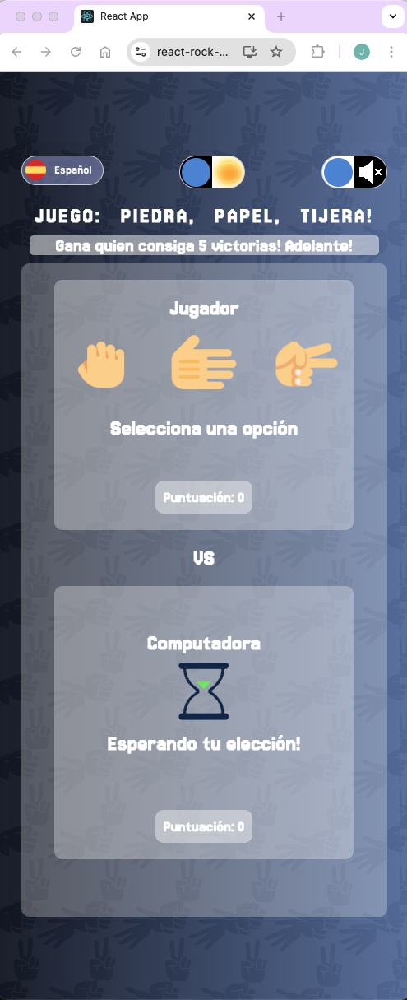
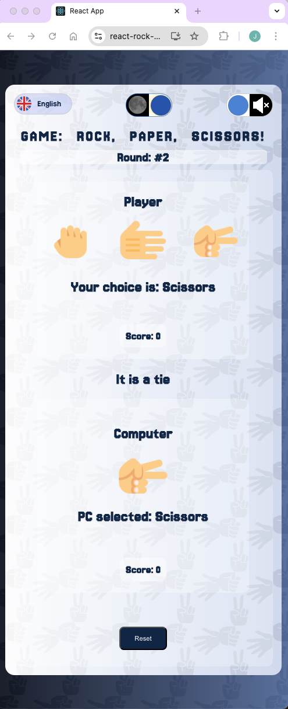
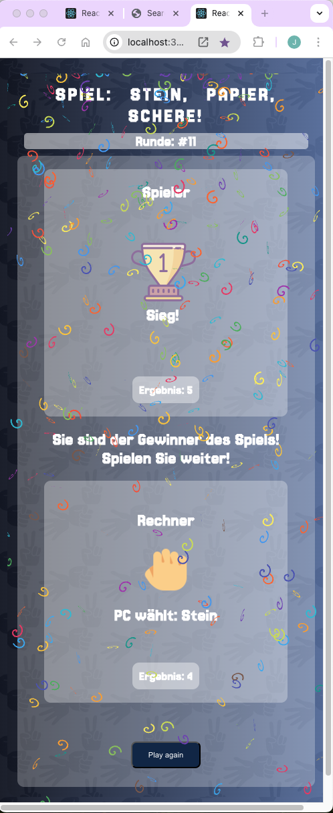

# Rock, Paper, Scissors - React Application

Welcome to the **Rock, Paper, Scissors** application! This is a modern take on the classic game, developed using React.

## Screenshots

Here are some screenshots of the Rock, Paper, Scissors application:

### Home Screen


### Game in Action



## Main Features

- **Hooks and Context API**: The application leverages `useState`, `createContext`, `useContext`, and `useEffect` to manage state and effects efficiently.
- **Dynamic Audio**: Integrated sound effects using the `use-sound` library to enhance the user experience.
- **Multilanguage Support**: The application is available in Spanish, German, and English. 🌎
- **CSS Animations**: Interactions and transitions are enhanced with CSS animations for a smoother user experience.
- **Local Storage**: User preferences and progress are saved in `localStorage` for quick and easy access.
- **Integrated Libraries**: Various libraries such as `react-confetti`, `react-icons`, `react-loader-spinner`, and others are used to add visual and functional details.

## Getting Started

To get started with the project, clone the repository and install the necessary dependencies:

```bash
git clone https://github.com/your-username/rock-paper-scissors.git
cd rock-paper-scissors
npm install